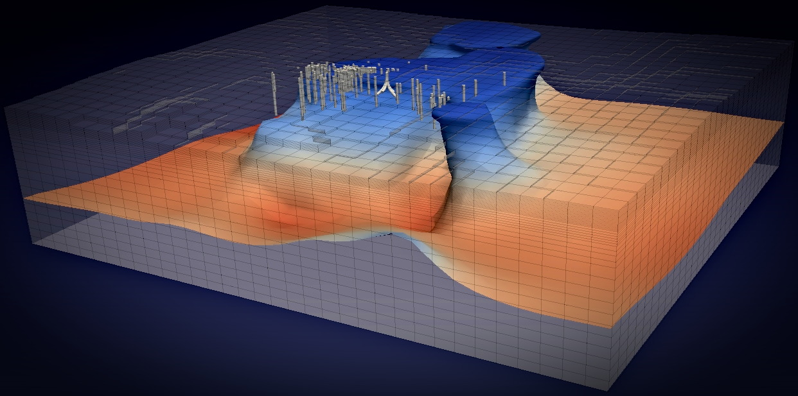

# 

***a parallel, open-source geothermal flow simulator***

Waiwera features:

- numerical simulation of high-temperature subsurface flows, including robust phase changes
- parallel execution on shared- or distributed-memory computers and clusters
- use of [PETSc](https://www.mcs.anl.gov/petsc/) (Portable Extensible Toolkit for Scientific Computation) for parallel data structures, linear and non-linear solvers, etc.
- standard file formats for input ([JSON](http://www.json.org)) and output ([HDF5](https://portal.hdfgroup.org/display/HDF5/HDF5), [YAML](http://www.yaml.org/about.html))
- structured, object-oriented code written in Fortran 2003
- free, open-source [license](license.md)

Waiwera was developed at the University of Auckland's [Geothermal Institute](http://www.geothermal.auckland.ac.nz/). Initial development was part of the "Geothermal Supermodels" research project, funded by the NZ Ministry of Business, Innovation and Employment ([MBIE](https://www.mbie.govt.nz/)), with additional support from [Contact Energy Ltd](https://contact.co.nz/).

The word *Waiwera* comes from the Māori language and means "hot water".
